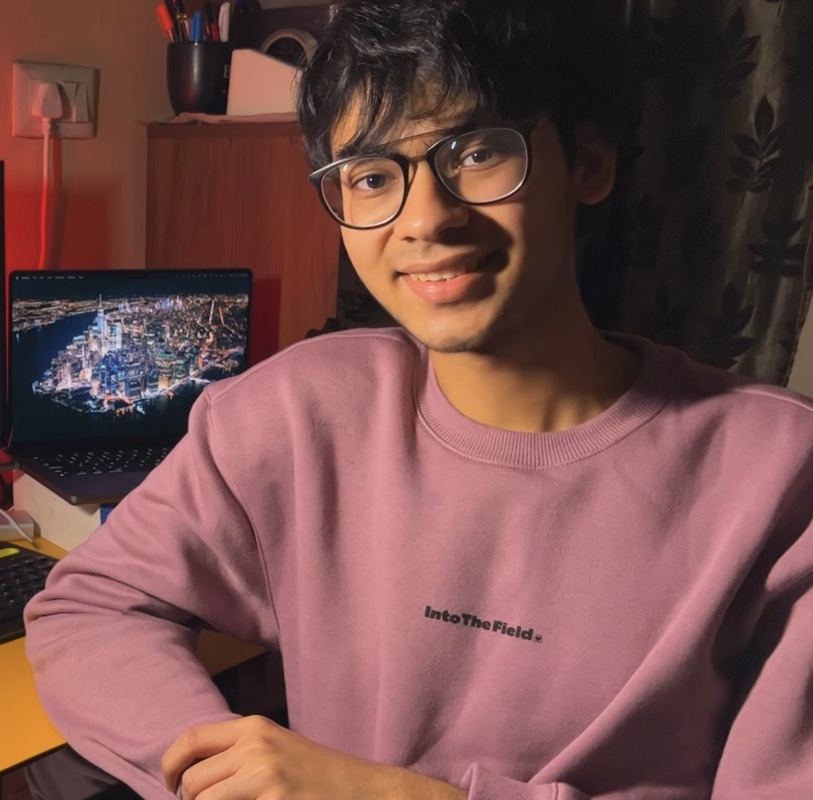

im akshit, also sometimes known as (vicious)a3gis. currently, i am interested in the robustness and explainability of graph neural networks. im a 4th year computer science undergrad at [iiit hyderabad](https://www.iiit.ac.in/), and im part of [the precog research group](https://precog.iiit.ac.in/), advised by dr. ponnurangam kumaraguru.

besides the nerdy stuff, i run a (slightly inactive) [youtube channel](https://www.youtube.com/channel/UCiZXxO_v7VVd8hYQiXoqZGg), i love watching football (i love liverpool fc; ynwa), playing video games, watching anime, playing chess, listening to music (mostly indie rock/pop), and occasionally reading sci-fi/dystopian/philosophical fiction specifically from 1960-1970s.

i also love kittens!!

## currently

- trying to write a blog
- ~~plotting the greatest academic comeback known to mankind~~
- applying to grad schools (soon)

## selected publications
- A Sinha, S Vennam, C Sharma, P Kumaraguru. 2024. [Generating Explanations for Cellular Neural Networks](https://arxiv.org/abs/2406.03253). arXiv preprint arXiv:2406.03253.

## where i work (right now)

- research intern @ [adobe research](https://research.adobe.com/)
- undergrad researcher @ [precog research group](https://precog.iiit.ac.in/)